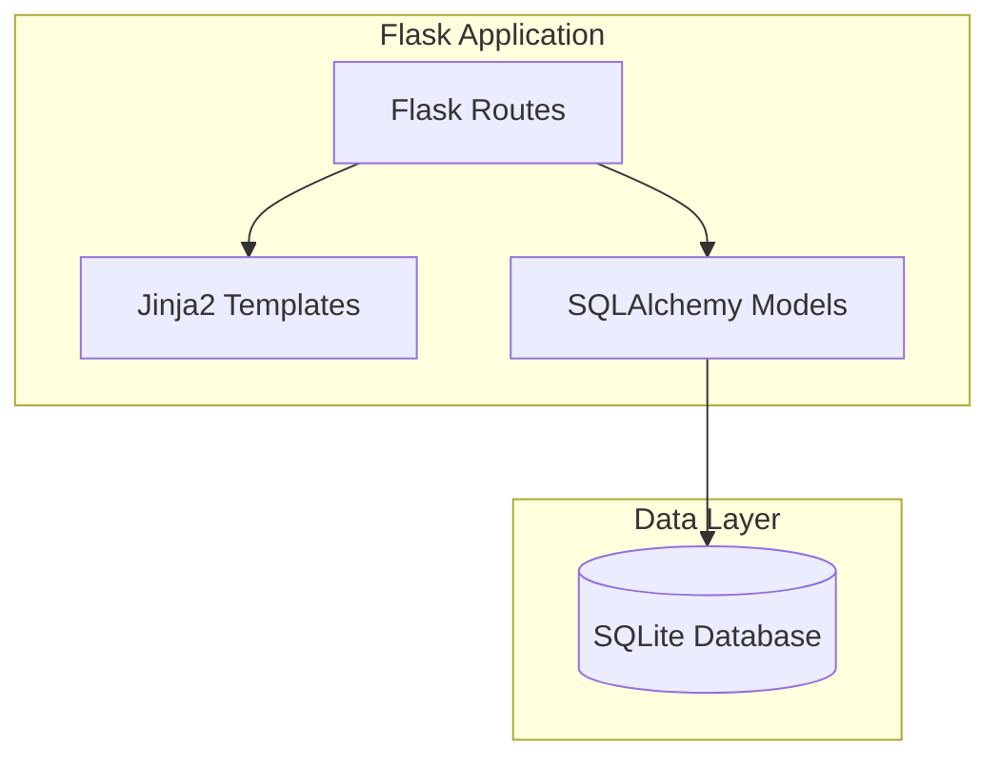
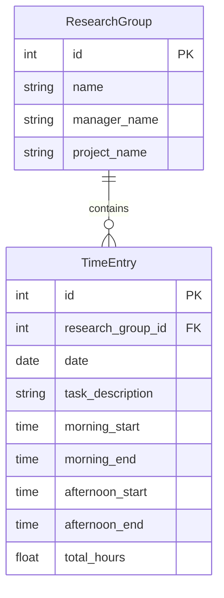

# Design Document: Flask Time Tracker

## Overview

A minimal Flask web application for tracking research group time entries. The system replaces Excel-based tracking with a simple web interface backed by SQLite. Employees can create research groups, log time entries with up to two time blocks per day, and view summaries with automatic pay calculations.

## Architecture



The application follows a simple MVC pattern:
- **Routes**: Handle HTTP requests and coordinate between models and templates
- **Models**: SQLAlchemy ORM models for data persistence
- **Templates**: Jinja2 templates for HTML rendering

## Components and Interfaces

### Flask Application Structure

```
app/
├── __init__.py      # Flask app factory
├── models.py        # SQLAlchemy models
├── routes.py        # Route handlers
└── templates/
    ├── base.html
    ├── groups.html
    ├── entries.html
    └── summary.html
```

### Route Handlers

```python
# Research Group Routes
GET  /groups              # List all research groups
POST /groups              # Create new research group
GET  /groups/<id>/entries # View entries for a group
POST /groups/<id>/entries # Add entry to a group
GET  /groups/<id>/summary # View summary for a group
```

### Model Interfaces

```python
class ResearchGroup:
    id: int
    name: str
    manager_name: str
    project_name: str
    
    def get_total_hours() -> float
    def get_total_pay(rate: float = 107.93) -> float

class TimeEntry:
    id: int
    research_group_id: int
    date: date
    task_description: str
    morning_start: time | None
    morning_end: time | None
    afternoon_start: time | None
    afternoon_end: time | None
    
    def calculate_total_hours() -> float
```

### Validation Functions

```python
def validate_time_block(start: time, end: time) -> bool:
    """Returns True if end > start"""

def validate_task_description(description: str) -> bool:
    """Returns True if description is non-empty after stripping whitespace"""

def validate_group_name(name: str) -> bool:
    """Returns True if name is non-empty after stripping whitespace"""
```

## Data Models

### Database Schema



### SQLAlchemy Models

```python
class ResearchGroup(db.Model):
    __tablename__ = 'research_groups'
    
    id = db.Column(db.Integer, primary_key=True)
    name = db.Column(db.String(100), nullable=False)
    manager_name = db.Column(db.String(100), nullable=False)
    project_name = db.Column(db.String(100), nullable=False)
    entries = db.relationship('TimeEntry', backref='group', lazy=True)

class TimeEntry(db.Model):
    __tablename__ = 'time_entries'
    
    id = db.Column(db.Integer, primary_key=True)
    research_group_id = db.Column(db.Integer, db.ForeignKey('research_groups.id'), nullable=False)
    date = db.Column(db.Date, nullable=False)
    task_description = db.Column(db.String(500), nullable=False)
    morning_start = db.Column(db.Time, nullable=True)
    morning_end = db.Column(db.Time, nullable=True)
    afternoon_start = db.Column(db.Time, nullable=True)
    afternoon_end = db.Column(db.Time, nullable=True)
    total_hours = db.Column(db.Float, nullable=False, default=0.0)
```

### Hours Calculation Logic

```python
def calculate_block_hours(start: time, end: time) -> float:
    """Calculate hours between two times."""
    if start is None or end is None:
        return 0.0
    start_minutes = start.hour * 60 + start.minute
    end_minutes = end.hour * 60 + end.minute
    return (end_minutes - start_minutes) / 60.0

def calculate_total_hours(entry: TimeEntry) -> float:
    """Calculate total hours from both time blocks."""
    morning = calculate_block_hours(entry.morning_start, entry.morning_end)
    afternoon = calculate_block_hours(entry.afternoon_start, entry.afternoon_end)
    return round(morning + afternoon, 2)
```


## Correctness Properties

*A property is a characteristic or behavior that should hold true across all valid executions of a system—essentially, a formal statement about what the system should do. Properties serve as the bridge between human-readable specifications and machine-verifiable correctness guarantees.*

### Property 1: Time Block Duration Calculation

*For any* valid time block (where end > start), the calculated duration SHALL equal (end_time - start_time) converted to hours.

**Validates: Requirements 3.3**

### Property 2: Total Hours Summation

*For any* time entry with two time blocks, the total hours SHALL equal the sum of the morning block duration plus the afternoon block duration.

**Validates: Requirements 2.2, 3.1**

### Property 3: Time Block Validation

*For any* time block where end_time <= start_time, the validation function SHALL return false and reject the entry.

**Validates: Requirements 2.4**

### Property 4: Empty String Validation

*For any* string composed entirely of whitespace (including empty string), the validation functions for group name and task description SHALL reject the input.

**Validates: Requirements 1.3, 2.5**

### Property 5: Research Group Round-Trip

*For any* valid research group data, creating a group and then listing all groups SHALL include the created group with matching name, manager, and project.

**Validates: Requirements 1.1, 1.2**

### Property 6: Time Entry Round-Trip

*For any* valid time entry, saving the entry and then retrieving entries for that group SHALL include the saved entry with all original data intact.

**Validates: Requirements 2.1, 4.2**

### Property 7: Entries Ordered by Date

*For any* research group with multiple entries, retrieving entries SHALL return them ordered by date descending (newest first).

**Validates: Requirements 4.1**

### Property 8: Summary Hours Aggregation

*For any* research group with entries, the summary total hours SHALL equal the sum of all individual entry total hours.

**Validates: Requirements 5.1**

### Property 9: Pay Calculation

*For any* total hours value, the calculated pay SHALL equal (total_hours * 107.93) rounded to two decimal places.

**Validates: Requirements 5.2, 5.3**

## Error Handling

| Error Condition | Response |
|----------------|----------|
| Empty group name | Display validation error, reject submission |
| Empty task description | Display validation error, reject submission |
| End time before start time | Display validation error, reject submission |
| Group not found | Return 404 error page |
| Database connection failure | Return 500 error page with generic message |

## Testing Strategy

### Unit Tests
- Validation functions (empty strings, time block validation)
- Hours calculation functions
- Pay calculation

### Property-Based Tests
Using `hypothesis` library for Python:
- Time block duration calculation (Property 1)
- Total hours summation (Property 2)
- Time validation (Property 3)
- Empty string validation (Property 4)

Each property test runs minimum 100 iterations.

### Integration Tests
- Group creation and listing flow
- Entry creation and retrieval flow
- Summary calculation flow
