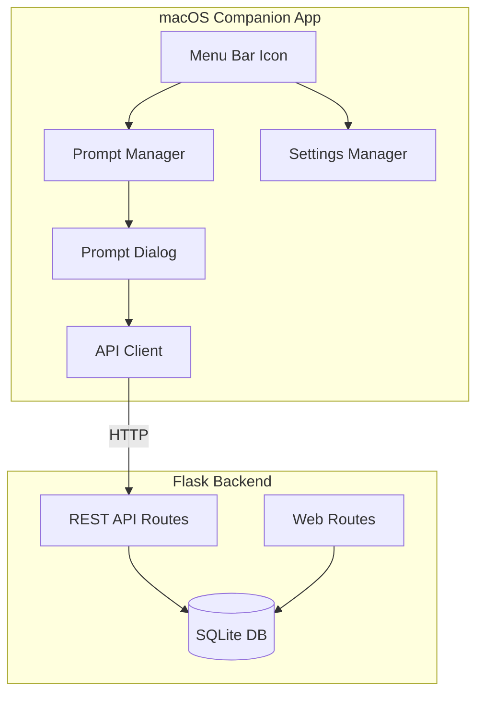

# Design Document: macOS Companion App

## Overview

This design describes a native macOS menu bar companion application for the existing Flask time tracker. The app uses SwiftUI with the `MenuBarExtra` API (available in macOS 13+) to create a lightweight, always-available time tracking assistant. The companion app communicates with the Flask backend via a new REST API layer that will be added to the existing application.

The architecture consists of two main components:
1. **Flask API Extension**: New REST endpoints added to the existing Flask app
2. **macOS SwiftUI App**: Native menu bar application using modern SwiftUI patterns

## Architecture



### Data Flow

1. **Startup**: App loads settings from UserDefaults, fetches research groups from API
2. **Timer Tick**: Every N minutes (configurable), prompt dialog appears
3. **User Submission**: Task description + group sent to API, time entry created
4. **Error Handling**: Network failures cached, retry on next prompt

## Components and Interfaces

### Flask API Extension

New REST API blueprint added to the existing Flask application.

```python
# app/api.py - New API Blueprint

from flask import Blueprint, jsonify, request
from datetime import datetime, time
from .models import db, ResearchGroup, TimeEntry, TimeBlock

api_bp = Blueprint('api', __name__, url_prefix='/api')

@api_bp.route('/groups', methods=['GET'])
def get_groups():
    """Return all research groups."""
    groups = ResearchGroup.query.all()
    return jsonify([{
        'id': g.id,
        'name': g.name,
        'manager_name': g.manager_name,
        'project_name': g.project_name
    } for g in groups])

@api_bp.route('/entries', methods=['POST'])
def create_entry():
    """Create a new time entry with time block."""
    data = request.get_json()
    
    # Validate required fields
    if not data.get('research_group_id'):
        return jsonify({'error': 'research_group_id required'}), 400
    if not data.get('task_description'):
        return jsonify({'error': 'task_description required'}), 400
    
    # Parse times
    start_time = time.fromisoformat(data['start_time'])
    end_time = time.fromisoformat(data['end_time'])
    entry_date = datetime.fromisoformat(data.get('date', datetime.now().isoformat())).date()
    
    # Calculate hours
    start_minutes = start_time.hour * 60 + start_time.minute
    end_minutes = end_time.hour * 60 + end_time.minute
    total_hours = round((end_minutes - start_minutes) / 60.0, 2)
    
    # Create entry
    entry = TimeEntry(
        research_group_id=data['research_group_id'],
        date=entry_date,
        task_description=data['task_description'].strip(),
        total_hours=total_hours
    )
    db.session.add(entry)
    db.session.flush()
    
    # Create time block
    block = TimeBlock(
        time_entry_id=entry.id,
        start_time=start_time,
        end_time=end_time
    )
    db.session.add(block)
    db.session.commit()
    
    return jsonify({
        'id': entry.id,
        'date': entry.date.isoformat(),
        'task_description': entry.task_description,
        'total_hours': entry.total_hours
    }), 201

@api_bp.route('/health', methods=['GET'])
def health_check():
    """Health check endpoint for connectivity testing."""
    return jsonify({'status': 'ok'})
```

### macOS App Structure

```
TimeTrackerCompanion/
├── TimeTrackerCompanionApp.swift    # App entry point with MenuBarExtra
├── Views/
│   ├── PromptView.swift             # Time logging prompt dialog
│   ├── SettingsView.swift           # Configuration settings
│   └── MenuContentView.swift        # Menu bar dropdown content
├── Models/
│   ├── ResearchGroup.swift          # Research group model
│   ├── TimeEntryRequest.swift       # API request model
│   └── AppSettings.swift            # User settings model
├── Services/
│   ├── APIClient.swift              # HTTP client for Flask API
│   ├── PromptManager.swift          # Timer and prompt scheduling
│   └── SettingsManager.swift        # UserDefaults persistence
└── Info.plist                       # App configuration (LSUIElement)
```

### SwiftUI App Entry Point

```swift
// TimeTrackerCompanionApp.swift
import SwiftUI

@main
struct TimeTrackerCompanionApp: App {
    @StateObject private var promptManager = PromptManager()
    @StateObject private var settingsManager = SettingsManager()
    
    var body: some Scene {
        MenuBarExtra("Time Tracker", systemImage: "clock.badge.checkmark") {
            MenuContentView()
                .environmentObject(promptManager)
                .environmentObject(settingsManager)
        }
        .menuBarExtraStyle(.window)
        
        Settings {
            SettingsView()
                .environmentObject(settingsManager)
        }
    }
}
```

### API Client Interface

```swift
// Services/APIClient.swift
import Foundation

class APIClient: ObservableObject {
    @Published var isConnected = false
    @Published var consecutiveFailures = 0
    
    private var baseURL: URL
    
    init(baseURL: URL = URL(string: "http://localhost:5000")!) {
        self.baseURL = baseURL
    }
    
    func updateBaseURL(_ url: URL) {
        self.baseURL = url
    }
    
    func fetchGroups() async throws -> [ResearchGroup] {
        let url = baseURL.appendingPathComponent("/api/groups")
        let (data, response) = try await URLSession.shared.data(from: url)
        
        guard let httpResponse = response as? HTTPURLResponse,
              httpResponse.statusCode == 200 else {
            throw APIError.requestFailed
        }
        
        consecutiveFailures = 0
        isConnected = true
        return try JSONDecoder().decode([ResearchGroup].self, from: data)
    }
    
    func createEntry(_ request: TimeEntryRequest) async throws -> TimeEntryResponse {
        let url = baseURL.appendingPathComponent("/api/entries")
        var urlRequest = URLRequest(url: url)
        urlRequest.httpMethod = "POST"
        urlRequest.setValue("application/json", forHTTPHeaderField: "Content-Type")
        urlRequest.httpBody = try JSONEncoder().encode(request)
        
        let (data, response) = try await URLSession.shared.data(for: urlRequest)
        
        guard let httpResponse = response as? HTTPURLResponse else {
            throw APIError.requestFailed
        }
        
        if httpResponse.statusCode == 201 {
            consecutiveFailures = 0
            isConnected = true
            return try JSONDecoder().decode(TimeEntryResponse.self, from: data)
        } else {
            consecutiveFailures += 1
            if consecutiveFailures >= 3 {
                isConnected = false
            }
            throw APIError.serverError(httpResponse.statusCode)
        }
    }
    
    func healthCheck() async -> Bool {
        let url = baseURL.appendingPathComponent("/api/health")
        do {
            let (_, response) = try await URLSession.shared.data(from: url)
            let connected = (response as? HTTPURLResponse)?.statusCode == 200
            isConnected = connected
            if connected { consecutiveFailures = 0 }
            return connected
        } catch {
            consecutiveFailures += 1
            if consecutiveFailures >= 3 { isConnected = false }
            return false
        }
    }
}

enum APIError: Error {
    case requestFailed
    case serverError(Int)
    case decodingError
}
```

### Prompt Manager

```swift
// Services/PromptManager.swift
import Foundation
import UserNotifications

class PromptManager: ObservableObject {
    @Published var showPrompt = false
    @Published var timeUntilNextPrompt: TimeInterval = 0
    @Published var skipNextPrompt = false
    
    private var timer: Timer?
    private var intervalMinutes: Int = 30
    private var lastPromptTime: Date?
    
    func start(intervalMinutes: Int) {
        self.intervalMinutes = intervalMinutes
        scheduleNextPrompt()
    }
    
    func stop() {
        timer?.invalidate()
        timer = nil
    }
    
    func triggerPromptNow() {
        showPrompt = true
        lastPromptTime = Date()
        scheduleNextPrompt()
    }
    
    func skipNext() {
        skipNextPrompt = true
    }
    
    private func scheduleNextPrompt() {
        timer?.invalidate()
        
        let interval = TimeInterval(intervalMinutes * 60)
        timeUntilNextPrompt = interval
        
        timer = Timer.scheduledTimer(withTimeInterval: 1.0, repeats: true) { [weak self] _ in
            guard let self = self else { return }
            self.timeUntilNextPrompt -= 1
            
            if self.timeUntilNextPrompt <= 0 {
                if self.skipNextPrompt {
                    self.skipNextPrompt = false
                } else {
                    self.showPrompt = true
                    self.lastPromptTime = Date()
                }
                self.timeUntilNextPrompt = interval
            }
        }
    }
    
    func calculateTimeBlock() -> (start: String, end: String) {
        let end = Date()
        let start = end.addingTimeInterval(-TimeInterval(intervalMinutes * 60))
        
        let formatter = DateFormatter()
        formatter.dateFormat = "HH:mm"
        
        return (formatter.string(from: start), formatter.string(from: end))
    }
}
```

### Settings Manager

```swift
// Services/SettingsManager.swift
import Foundation

class SettingsManager: ObservableObject {
    @Published var promptIntervalMinutes: Int {
        didSet { UserDefaults.standard.set(promptIntervalMinutes, forKey: "promptInterval") }
    }
    
    @Published var backendURL: String {
        didSet { UserDefaults.standard.set(backendURL, forKey: "backendURL") }
    }
    
    @Published var defaultGroupId: Int? {
        didSet { UserDefaults.standard.set(defaultGroupId, forKey: "defaultGroupId") }
    }
    
    @Published var launchAtLogin: Bool {
        didSet { UserDefaults.standard.set(launchAtLogin, forKey: "launchAtLogin") }
    }
    
    init() {
        self.promptIntervalMinutes = UserDefaults.standard.integer(forKey: "promptInterval")
        if self.promptIntervalMinutes == 0 { self.promptIntervalMinutes = 30 }
        
        self.backendURL = UserDefaults.standard.string(forKey: "backendURL") ?? "http://localhost:5000"
        self.defaultGroupId = UserDefaults.standard.object(forKey: "defaultGroupId") as? Int
        self.launchAtLogin = UserDefaults.standard.bool(forKey: "launchAtLogin")
    }
}
```

## Data Models

### Swift Models

```swift
// Models/ResearchGroup.swift
struct ResearchGroup: Codable, Identifiable, Hashable {
    let id: Int
    let name: String
    let manager_name: String
    let project_name: String
}

// Models/TimeEntryRequest.swift
struct TimeEntryRequest: Codable {
    let research_group_id: Int
    let task_description: String
    let date: String
    let start_time: String
    let end_time: String
}

// Models/TimeEntryResponse.swift
struct TimeEntryResponse: Codable {
    let id: Int
    let date: String
    let task_description: String
    let total_hours: Double
}
```

### API Request/Response Formats

**GET /api/groups**
```json
[
  {
    "id": 1,
    "name": "Research Team A",
    "manager_name": "John Smith",
    "project_name": "Project Alpha"
  }
]
```

**POST /api/entries**
Request:
```json
{
  "research_group_id": 1,
  "task_description": "Working on feature implementation",
  "date": "2024-01-15",
  "start_time": "09:30",
  "end_time": "10:00"
}
```

Response (201):
```json
{
  "id": 42,
  "date": "2024-01-15",
  "task_description": "Working on feature implementation",
  "total_hours": 0.5
}
```

**GET /api/health**
```json
{
  "status": "ok"
}
```

## Correctness Properties

*A property is a characteristic or behavior that should hold true across all valid executions of a system—essentially, a formal statement about what the system should do. Properties serve as the bridge between human-readable specifications and machine-verifiable correctness guarantees.*

### Property 1: Timer fires at configured interval

*For any* configured prompt interval N minutes, the PromptManager SHALL trigger a prompt after exactly N minutes of elapsed time (within 1 second tolerance).

**Validates: Requirements 2.1**

### Property 2: Valid submission creates correct API request

*For any* valid task description and selected research group, when the user submits the prompt dialog, the API client SHALL send a POST request containing the task description, research_group_id, current date, and calculated time block.

**Validates: Requirements 2.3, 3.3**

### Property 3: Dismissal preserves state

*For any* prompt dialog dismissal (without submission), the app SHALL NOT make any API calls and the timer SHALL continue counting toward the next prompt.

**Validates: Requirements 2.4**

### Property 4: Groups fetch returns valid models

*For any* successful API response from /api/groups, the API client SHALL parse the JSON into an array of ResearchGroup objects with id, name, manager_name, and project_name fields.

**Validates: Requirements 3.2**

### Property 5: Network failure handling

*For any* network failure when attempting to create a time entry, the app SHALL display an error notification and SHALL NOT crash or lose user input.

**Validates: Requirements 3.4**

### Property 6: Time block calculation

*For any* prompt interval of N minutes, when creating a time entry, the start_time SHALL equal (current_time - N minutes) and end_time SHALL equal current_time.

**Validates: Requirements 3.5**

### Property 7: Interval change reschedules timer

*For any* change to the prompt interval setting from N to M minutes, the PromptManager SHALL reschedule the timer to fire in M minutes from the time of change.

**Validates: Requirements 4.2**

### Property 8: URL change updates API client

*For any* change to the backend URL setting, all subsequent API calls SHALL use the new URL.

**Validates: Requirements 4.3**

### Property 9: Settings persistence round-trip

*For any* settings value (interval, URL, default group), saving the value and then reading it back (including after simulated restart) SHALL return the same value.

**Validates: Requirements 4.4**

### Property 10: Skip action skips exactly one prompt

*For any* "skip next prompt" action, exactly one scheduled prompt SHALL be skipped, and the subsequent prompt SHALL fire normally at the next interval.

**Validates: Requirements 5.2**

### Property 11: API error notification

*For any* non-2xx HTTP response when creating a time entry, the app SHALL display an error notification containing information about the failure.

**Validates: Requirements 6.1**

### Property 12: Connection state tracking

*For any* sequence of API calls, if 3 or more consecutive calls fail, the isConnected state SHALL be false. When a call succeeds after failures, isConnected SHALL become true and consecutiveFailures SHALL reset to 0.

**Validates: Requirements 6.2, 6.3**

## Error Handling

### Network Errors

| Error Type | Handling Strategy |
|------------|-------------------|
| Connection refused | Show notification "Cannot connect to time tracker. Is the Flask server running?" |
| Timeout | Show notification "Request timed out. Will retry on next prompt." |
| DNS failure | Show notification "Cannot resolve server address. Check your settings." |

### API Errors

| Status Code | Handling Strategy |
|-------------|-------------------|
| 400 Bad Request | Show notification with validation error from response body |
| 404 Not Found | Show notification "API endpoint not found. Check server version." |
| 500 Server Error | Show notification "Server error occurred. Entry not saved." |

### State Recovery

- On startup, if backend is unreachable, app continues with cached group list (if available)
- Failed entries are NOT queued for retry (user can manually re-enter)
- Connection status indicator in menu shows current state

## Testing Strategy

### Unit Tests

Unit tests focus on specific examples and edge cases:

1. **SettingsManager Tests**
   - Default values on fresh install
   - Persistence of each setting type
   - Invalid URL handling

2. **PromptManager Tests**
   - Timer scheduling accuracy
   - Skip functionality
   - Manual trigger behavior

3. **APIClient Tests**
   - Request formatting
   - Response parsing
   - Error handling for each status code

4. **Time Calculation Tests**
   - Time block calculation with various intervals
   - Edge cases: midnight crossing, DST transitions

### Property-Based Tests

Property-based tests verify universal properties across randomized inputs. Each test runs minimum 100 iterations.

**Testing Framework**: Swift's `swift-testing` with custom property test helpers or XCTest with randomized inputs.

1. **Settings Round-Trip Property** (Property 9)
   - Generate random valid settings
   - Save, "restart" (clear in-memory state), load
   - Verify equality

2. **Time Block Calculation Property** (Property 6)
   - Generate random intervals (1-120 minutes)
   - Generate random current times
   - Verify start_time + interval = end_time

3. **Connection State Tracking Property** (Property 12)
   - Generate random sequences of success/failure API results
   - Verify state machine transitions correctly

4. **API Request Format Property** (Property 2)
   - Generate random valid task descriptions and group IDs
   - Verify request contains all required fields with correct types

### Integration Tests

1. **Flask API Tests** (Python/pytest)
   - Test each endpoint with valid/invalid inputs
   - Verify database state after operations

2. **End-to-End Tests**
   - Start Flask server
   - Run companion app
   - Verify time entry creation flow

