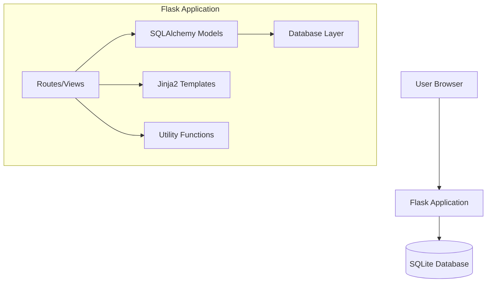
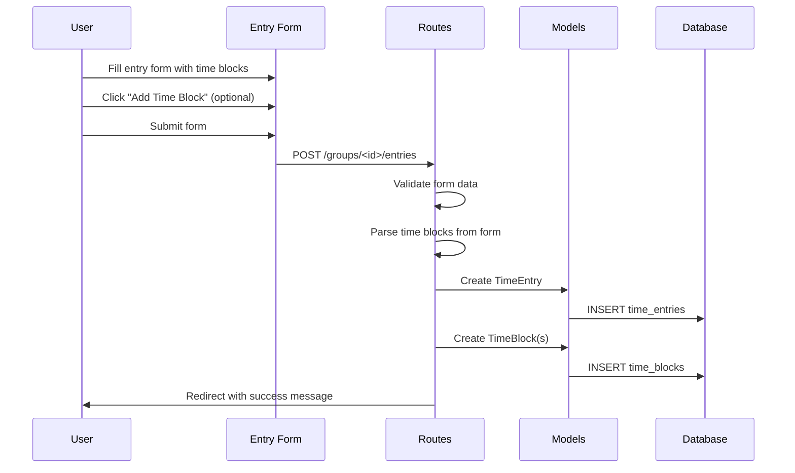
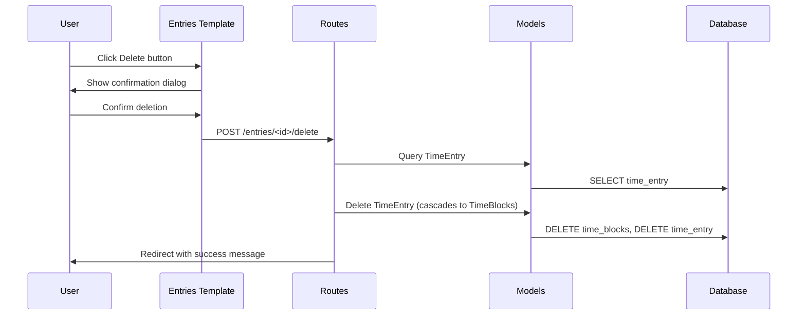
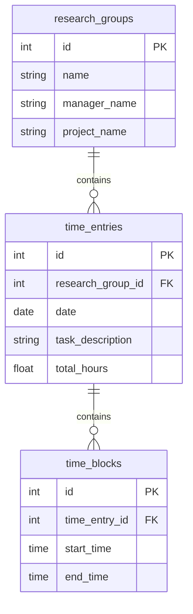

# Design Document: Time Tracker Enhancements

## Overview

This design document describes the technical implementation for enhancing the Flask Time Tracker application with multiple time blocks per entry and entry deletion functionality. The design maintains backward compatibility with existing data through a migration strategy while introducing a more flexible data model.

The key architectural changes include:
1. A new `TimeBlock` model with a one-to-many relationship to `TimeEntry`
2. Dynamic form handling for adding/removing time blocks in the UI
3. A delete endpoint with confirmation workflow
4. Database migration to convert existing fixed morning/afternoon columns to the new flexible model

## Architecture

### System Context



### Data Flow for Time Entry Creation



### Data Flow for Entry Deletion



## Components and Interfaces

### 1. TimeBlock Model

New SQLAlchemy model for storing individual time blocks.

```python
class TimeBlock(db.Model):
    """Individual time block within a time entry."""
    __tablename__ = 'time_blocks'
    
    id: int                    # Primary key
    time_entry_id: int         # Foreign key to TimeEntry
    start_time: time           # Block start time (required)
    end_time: time             # Block end time (required)
    
    # Relationships
    entry: TimeEntry           # Back-reference to parent entry
    
    def duration_hours(self) -> float:
        """Calculate duration in hours."""
        pass
```

### 2. Updated TimeEntry Model

Modified to use the new TimeBlock relationship.

```python
class TimeEntry(db.Model):
    """Time entry model - updated to use TimeBlock relationship."""
    __tablename__ = 'time_entries'
    
    id: int
    research_group_id: int
    date: date
    task_description: str
    total_hours: float         # Cached sum of all time blocks
    
    # Relationships
    time_blocks: List[TimeBlock]  # One-to-many relationship
    group: ResearchGroup
    
    def calculate_total_hours(self) -> float:
        """Sum duration of all time blocks."""
        pass
    
    def get_sorted_time_blocks(self) -> List[TimeBlock]:
        """Return time blocks sorted by start_time."""
        pass
```

### 3. Routes Interface

New and modified route handlers:

```python
# Existing route - modified
@bp.route('/groups/<int:group_id>/entries', methods=['GET', 'POST'])
def entries(group_id: int):
    """Handle entry listing and creation with multiple time blocks."""
    pass

# New route
@bp.route('/entries/<int:entry_id>/delete', methods=['POST'])
def delete_entry(entry_id: int):
    """Delete a time entry with cascade to time blocks."""
    pass
```

### 4. Utility Functions

New and updated utility functions:

```python
def validate_time_block(start: time, end: time) -> bool:
    """Validate that end time is after start time."""
    pass

def calculate_block_hours(start: time, end: time) -> float:
    """Calculate hours for a single time block."""
    pass

def calculate_total_hours_from_blocks(blocks: List[Tuple[time, time]]) -> float:
    """Calculate total hours from a list of time block tuples."""
    pass

def parse_time_blocks_from_form(form_data: dict) -> List[Tuple[time, time]]:
    """Parse multiple time blocks from form submission."""
    pass
```

### 5. Template Components

#### Entry Form (entries.html)
- Dynamic time block inputs with add/remove buttons
- JavaScript for client-side block management
- Form validation feedback

#### Entry List (entries.html)
- Display all time blocks per entry
- Delete button with confirmation dialog

#### Summary (summary.html)
- Updated to work with new total hours calculation

## Data Models

### Database Schema



### TimeBlock Table Schema

| Column | Type | Constraints | Description |
|--------|------|-------------|-------------|
| id | INTEGER | PRIMARY KEY, AUTOINCREMENT | Unique identifier |
| time_entry_id | INTEGER | FOREIGN KEY, NOT NULL, ON DELETE CASCADE | Reference to parent entry |
| start_time | TIME | NOT NULL | Block start time |
| end_time | TIME | NOT NULL | Block end time |

### Migration Strategy

The migration will:
1. Create the new `time_blocks` table
2. For each existing `TimeEntry`:
   - If `morning_start` and `morning_end` exist, create a TimeBlock
   - If `afternoon_start` and `afternoon_end` exist, create a TimeBlock
3. Remove the deprecated columns from `time_entries` table

```python
def migrate_to_time_blocks():
    """Migrate existing morning/afternoon data to TimeBlock records."""
    entries = TimeEntry.query.all()
    for entry in entries:
        if entry.morning_start and entry.morning_end:
            block = TimeBlock(
                time_entry_id=entry.id,
                start_time=entry.morning_start,
                end_time=entry.morning_end
            )
            db.session.add(block)
        if entry.afternoon_start and entry.afternoon_end:
            block = TimeBlock(
                time_entry_id=entry.id,
                start_time=entry.afternoon_start,
                end_time=entry.afternoon_end
            )
            db.session.add(block)
    db.session.commit()
```


## Correctness Properties

*A property is a characteristic or behavior that should hold true across all valid executions of a system—essentially, a formal statement about what the system should do. Properties serve as the bridge between human-readable specifications and machine-verifiable correctness guarantees.*

Based on the acceptance criteria analysis, the following properties have been identified for property-based testing:

### Property 1: Time Block Validation

*For any* time block with start_time and end_time, the validation function SHALL return true if and only if end_time > start_time.

**Validates: Requirements 1.3, 2.5**

### Property 2: Cascade Delete Integrity

*For any* TimeEntry with associated TimeBlock records, when the TimeEntry is deleted, all associated TimeBlock records SHALL also be deleted from the database.

**Validates: Requirements 1.4, 5.3**

### Property 3: Time Block Retrieval Completeness

*For any* TimeEntry with N associated TimeBlock records, querying the entry's time_blocks relationship SHALL return exactly N TimeBlock records.

**Validates: Requirements 3.1**

### Property 4: Time Block Chronological Ordering

*For any* TimeEntry with multiple TimeBlock records, the get_sorted_time_blocks() method SHALL return blocks sorted in ascending order by start_time.

**Validates: Requirements 3.3**

### Property 5: Total Hours Calculation

*For any* TimeEntry with one or more TimeBlock records, the calculate_total_hours() method SHALL return the sum of all block durations (each calculated as (end_time - start_time) in hours), rounded to two decimal places.

**Validates: Requirements 4.1, 4.2, 4.3**

### Property 6: Group Total Hours Aggregation

*For any* ResearchGroup with N TimeEntry records, the get_total_hours() method SHALL return the sum of total_hours from all associated entries.

**Validates: Requirements 4.4**

### Property 7: Group Total Update on Entry Deletion

*For any* ResearchGroup, when a TimeEntry is deleted, the group's get_total_hours() SHALL decrease by exactly the deleted entry's total_hours value.

**Validates: Requirements 5.5**

### Property 8: Migration Data Preservation

*For any* TimeEntry with morning and/or afternoon time data, after migration:
- If morning_start and morning_end existed, a TimeBlock with those values SHALL exist
- If afternoon_start and afternoon_end existed, a TimeBlock with those values SHALL exist
- The entry's total_hours SHALL remain unchanged

**Validates: Requirements 6.1, 6.2, 6.3, 6.4**

## Error Handling

### Form Validation Errors

| Error Condition | Error Message | Behavior |
|-----------------|---------------|----------|
| No time blocks provided | "At least one complete time block is required." | Reject submission, preserve form data |
| Time block end <= start | "Time block end time must be after start time." | Reject submission, highlight invalid block |
| Empty task description | "Task description cannot be empty." | Reject submission, preserve form data |
| Invalid date format | "Invalid date format." | Reject submission, preserve form data |
| Incomplete time block (only start or end) | "Time block must have both start and end times." | Reject submission, preserve form data |

### Database Errors

| Error Condition | Handling |
|-----------------|----------|
| Foreign key constraint violation | Roll back transaction, display error message |
| Entry not found for deletion | Return 404 error |
| Database connection failure | Display generic error, log details |

### Delete Operation Errors

| Error Condition | Error Message | Behavior |
|-----------------|---------------|----------|
| Entry not found | "Time entry not found." | Return 404 |
| Unauthorized deletion attempt | "You cannot delete this entry." | Return 403 (if auth added later) |

## Testing Strategy

### Dual Testing Approach

This feature will use both unit tests and property-based tests for comprehensive coverage:

- **Unit tests**: Verify specific examples, edge cases, and error conditions
- **Property tests**: Verify universal properties across randomly generated inputs

### Property-Based Testing Configuration

- **Library**: hypothesis (already used in the project)
- **Minimum iterations**: 100 per property test
- **Tag format**: `Feature: time-tracker-enhancements, Property {number}: {property_text}`

### Test Categories

#### Unit Tests

1. **Model Tests**
   - TimeBlock creation with valid data
   - TimeBlock duration calculation for specific times
   - TimeEntry with single time block
   - TimeEntry with multiple time blocks
   - Cascade delete behavior

2. **Validation Tests**
   - Empty time block list rejection
   - Invalid time range rejection (end <= start)
   - Valid time block acceptance
   - Form parsing with multiple blocks

3. **Route Tests**
   - POST /groups/<id>/entries with multiple time blocks
   - POST /entries/<id>/delete success case
   - POST /entries/<id>/delete with non-existent entry

4. **Migration Tests**
   - Migration of entry with morning only
   - Migration of entry with afternoon only
   - Migration of entry with both blocks
   - Migration of entry with no time data

#### Property-Based Tests

Each correctness property from the design will be implemented as a property-based test:

1. **Property 1**: Generate random time pairs, verify validation logic
2. **Property 2**: Create entries with random blocks, delete, verify cascade
3. **Property 3**: Create entries with random number of blocks, verify retrieval count
4. **Property 4**: Create entries with random blocks, verify sort order
5. **Property 5**: Create entries with random blocks, verify total calculation
6. **Property 6**: Create groups with random entries, verify group total
7. **Property 7**: Create group, delete random entry, verify total update
8. **Property 8**: Create entries with old schema data, migrate, verify preservation

### Test File Structure

```
tests/
├── test_utils.py          # Existing utility tests (update for new functions)
├── test_models.py         # New model tests for TimeBlock
├── test_routes.py         # Route integration tests
└── test_migration.py      # Migration-specific tests
```
